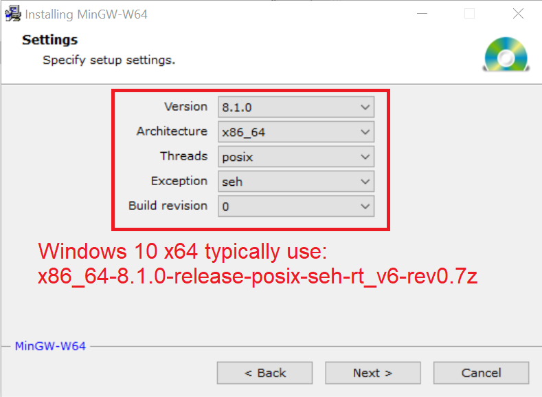

# mingw-w64
MinGW-W64 GCC-8.1.0 Mirror

Official Website: [MinGW-W64](http://mingw-w64.org/doku.php)

## Installation Instructions

1. Determine the MingGW architecture:
  * Version: **8.1.0**
  * Architecture: **i686** or **x86_64**
    * **i686**: is the 32-bit version
    * **x86_64**: is the 64-bit version of the OS (**Recommended**)
  * Threads: **posix** or **win32**
    * **posix**: Enable C++11/C11 multithreading features. (**Recommended**)
       * Note: Makes libgcc depend on libwinpthreads, so that even if you don't directly call pthreads API, you'll be distributing the winpthreads DLL. There's nothing wrong with distributing one more DLL with your application.
    * **win32**: No C++11 multithreading features.
  * Exception: **dwarf** or **sjlj**
    * **seh**: Available for 64-bit GCC 4.8 (x86_64) (**Recommended**)
      * Performance: Zero overhead exception 
    * **dwarf**: Available for 32 bit only (i686).
      * Performance: No permanent runtime overhead.
    * **sjlj**: Available for 32 bit and 64 bit.
      * Performance: ~15% in exception heavy code
  * Build revision: **0**

**Recommended for Windows 10 x64:**
  * Version = **8.1.0**
  * Architecture = **x86_64** (x64 OS)
  * Threads = **posix** (Allow threading)
  * Exception = **seh** (Zero overhead exception)
  * Build revision = **0**

2. Download the appropriate 7-zip (*.7z) file to your local machine:
  * ARCHITECTURE-VERSION-THREAD-EXCEPTION-*.7z

**Recommended for Windows 10 x64:**
  * x86_64-8.1.0-release-posix-seh-rt_v6-rev0.7z

3. Unzip the 7-Zip file to **C:\mingw-w64\mingw64**

4. Add **C:\mingw-w64\mingw64\bin** to **PATH**

Batch File:

```
echo off
set PATH=C:\mingw-w64\mingw64\bin;%PATH%
rem echo %PATH%
rem cd "C:\mingw-w64\mingw64\bin"
cd "C:\"
"C:\WINDOWS\system32\cmd.exe"
```

5. Open a new **cmd.exe** and verify the GCC compiler is setup.

```
>>> gcc -v
```

## Background

The **mingw-w64-install.exe** online installer is a minimal application that downloads the correct MingGW architecture version from SourceForge using a file lookup **repository.txt** here:

[Home / Toolchains targetting Win32 / Personal Builds / mingw-builds / installer / repository.txt](https://sourceforge.net/projects/mingw-w64/files/Toolchains%20targetting%20Win32/Personal%20Builds/mingw-builds/installer/)



Formatted as:

```
8.1.0|x86_64|posix|sjlj |rev0 |http://sourceforge.net/projects/mingw-w64/files/Toolchains%20targetting%20Win64/Personal%20Builds/mingw-builds/8.1.0/threads-posix/sjlj/x86_64-8.1.0-release-posix-sjlj-rt_v6-rev0.7z
8.1.0|i686  |posix|sjlj |rev0 |http://sourceforge.net/projects/mingw-w64/files/Toolchains%20targetting%20Win32/Personal%20Builds/mingw-builds/8.1.0/threads-posix/sjlj/i686-8.1.0-release-posix-sjlj-rt_v6-rev0.7z
8.1.0|i686  |posix|dwarf|rev0 |http://sourceforge.net/projects/mingw-w64/files/Toolchains%20targetting%20Win32/Personal%20Builds/mingw-builds/8.1.0/threads-posix/dwarf/i686-8.1.0-release-posix-dwarf-rt_v6-rev0.7z
8.1.0|x86_64|posix|seh  |rev0 |http://sourceforge.net/projects/mingw-w64/files/Toolchains%20targetting%20Win64/Personal%20Builds/mingw-builds/8.1.0/threads-posix/seh/x86_64-8.1.0-release-posix-seh-rt_v6-rev0.7z
8.1.0|i686  |win32|sjlj |rev0 |http://sourceforge.net/projects/mingw-w64/files/Toolchains%20targetting%20Win32/Personal%20Builds/mingw-builds/8.1.0/threads-win32/sjlj/i686-8.1.0-release-win32-sjlj-rt_v6-rev0.7z
8.1.0|x86_64|win32|sjlj |rev0 |http://sourceforge.net/projects/mingw-w64/files/Toolchains%20targetting%20Win64/Personal%20Builds/mingw-builds/8.1.0/threads-win32/sjlj/x86_64-8.1.0-release-win32-sjlj-rt_v6-rev0.7z
8.1.0|x86_64|win32|seh  |rev0 |http://sourceforge.net/projects/mingw-w64/files/Toolchains%20targetting%20Win64/Personal%20Builds/mingw-builds/8.1.0/threads-win32/seh/x86_64-8.1.0-release-win32-seh-rt_v6-rev0.7z
8.1.0|i686  |win32|dwarf|rev0 |http://sourceforge.net/projects/mingw-w64/files/Toolchains%20targetting%20Win32/Personal%20Builds/mingw-builds/8.1.0/threads-win32/dwarf/i686-8.1.0-release-win32-dwarf-rt_v6-rev0.7z
```

The installer downloads the appropriate 7-Zip MinGW file and extracts the content to **C:\wingw-w64** or **C:\Program Files (x86)\mingw-w64**. The **<mingw-w64>\mingw64\bin** is then registered with **PATH** environment.
